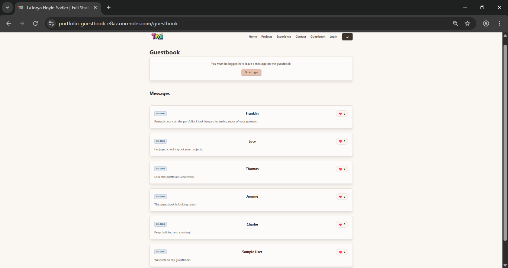

# 🚀 Full-Stack Portfolio Guestbook

A full-stack portfolio application with a MongoDB-powered guestbook. Visitors can view approved guestbook messages, while authenticated users can submit messages and like entries. Admin users can approve or delete guestbook submissions.

---

## 🔗 Live Application

* **Frontend:** https://portfolio-guestbook-e8az.onrender.com
* **Backend API:** https://portfolio-guestbook-br32.onrender.com

---

## 🎥 Project Demo

[Watch the Full-Stack Portfolio Guestbook Demo](https://www.loom.com/share/23296ed80c654bc59986e20dd459142e)

---

## 📸 Production Workspace Preview


> 💡 **Grading Note:** The preview above was captured at a 50% zoom scale to display the full continuity of the 6 required sample entries on a single screen. For crisp, high-resolution rendering of the custom sequential database ID tags (`GB-0001` through `GB-0006`) and responsive UI badges, please visit the live site directly

---

## 🛠️ Tech Stack

* React
* Vite
* JavaScript
* Node.js
* Express.js
* MongoDB Atlas
* Mongoose
* JWT Authentication
* bcrypt
* Zod
* Render

---

## 🛠️ Local Project Setup

### 1. Clone the repository

```bash
git clone YOUR-GITHUB-REPOSITORY-URL
cd YOUR-PROJECT-FOLDER
```

### 2. Install dependencies

Install the backend dependencies:

```bash
cd server
npm install
```

Install the frontend dependencies:

```bash
cd client
npm install
cd ..
```

### 3. Configure environment variables

Create a `.env` file inside the server directory using `.env.example` as the template.

Add the required environment variables without committing any real secrets to GitHub.

### 4. Seed the database

From the server directory, run:

```bash
npm run seed
```

The seed script clears the existing development data, resets the Guestbook ID counter, creates the admin account, and creates sample Guestbook entries.

### 5. Start the application

Start the backend:

```bash
cd server
npm run dev
```

In a second terminal, start the frontend:

```bash
cd client
npm run dev
```

---

## 🗺️ API Routes

| Method   | Path                         | Who Can Use It      | Returns                            |
| -------- | ---------------------------- | ------------------- | ---------------------------------- |
| `GET`    | `/api/health`                | Anyone              | API health status                  |
| `POST`   | `/api/auth/register`         | Anyone              | Creates a user account             |
| `POST`   | `/api/auth/login`            | Anyone              | Returns a JWT                      |
| `GET`    | `/api/guestbook`             | Anyone              | Returns approved Guestbook entries |
| `POST`   | `/api/guestbook`             | Authenticated users | Creates a pending Guestbook entry  |
| `POST`   | `/api/guestbook/:id/like`    | Authenticated users | Adds one like to a Guestbook entry |
| `GET`    | `/api/guestbook/pending`     | Admin               | Returns pending Guestbook entries  |
| `PATCH`  | `/api/guestbook/:id/approve` | Admin               | Approves a Guestbook entry         |
| `DELETE` | `/api/guestbook/:id`         | Admin               | Deletes a Guestbook entry          |

---

## ❤️ Atomic Likes & Race Condition Testing

The Guestbook like route uses an atomic MongoDB update to prevent the same user from successfully liking an entry multiple times during simultaneous requests.

The race test sends 10 concurrent like requests from the same authenticated user.

### `scripts/race.js` Output

🏁 Starting Guestbook like race test...

✅ Connected to MongoDB Atlas
👤 Created race test user profile
📖 Testing entry: GB-0001
❤️ Likes before race: 0

🔐 Race test user logged in successfully
🚀 Firing 10 concurrent requests simultaneously to production server...

📊 Race Test Response Statuses:
HTTP Status 200 Responses: 1
HTTP Status 409 Responses: 9

❤️ Likes before: 0
❤️ Likes after: 1
❤️ Likes increased by: 1

✅ RACE TEST PASSED
Exactly 1 like was accepted and duplicate entries were successfully blocked with a 409 status code.


The test demonstrates that only one request successfully adds the like while the remaining duplicate requests are rejected.

---

## ⚠️ Known Limitations

* **Authentication Storage:** Authentication state is stored in the browser's local storage. Clearing the browser's stored application data requires the user to log in again.
* **Cold Starts:** Because the application is deployed on Render's free tier, the service may take additional time to respond after a period of inactivity.
* **Guestbook Scope:** The current version focuses on the required Guestbook functionality and does not include additional account-management features.

---

## 🔮 Future Improvements

Possible future improvements include:

* Adding additional Guestbook features such as editing.
* Adding expanded administrative user management.
* Expanding account management features.

---

## 👨‍💻 Author
* **LaTorya Hoyle-Sadler** **ToyMind interactive** - *Fullstack Software Engineer & Interactive Experience Developer*
